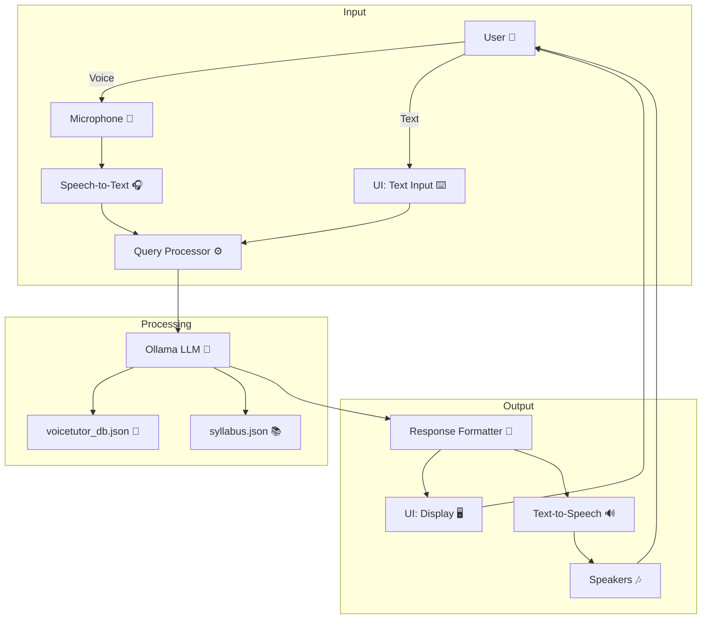

# 🎤 Voice Tutor – Open-Source, Offline Educational Assistant Powered by Local LLM

<div align="center">


**A 100% offline, open-source, voice-driven tutor that's free, flexible, and aligned with the Victorian Curriculum F–10 Version 2.0**

</div>

---

## 🌟 Overview

While tech giants pour AI into enterprise tools—think automated analytics or chatbots—let's talk about something more grounded: helping kids learn when life's too busy for one-on-one teaching. **Voice Tutor** is the answer—a **100% offline, open-source, voice-driven tutor** that's free, flexible, and aligned with the **Victorian Curriculum F–10 Version 2.0**. It's not a locked-down app that costs as much as a new phone. It's a build-it-yourself kit, ready for you to tweak, break, and learn from.

Voice Tutor supports both **voice** and **text-based** interactions, allowing learners to speak or type their questions and receive responses in **voice and text**. It's designed to be engaging, hands-free, and accessible for all.

## 🚀 Features

- 🎤 **Voice Input**: Ask questions by speaking, powered by speech recognition
- 💬 **Chat Input**: Type queries for a traditional chat experience
- 🗣️ **Voice Output**: Answers are read aloud using text-to-speech (TTS)
- 📃 **Text Output**: Responses are displayed on screen for clarity and review
- 🎓 **Curriculum-Aligned**: Pulls from a knowledge base tied to the Victorian Curriculum F–10 Version 2.0
- 💻 **100% Offline**: Runs locally with no internet dependency
- 🛠️ **Open-Source**: Free to use, modify, and extend
- 🔊 **Multilingual Support**: Optional voice model expansions for different languages
- 📚 **Interactive Lessons**: Lessons designed for an engaging learning experience

## 🏗️ System Architecture



### 📋 Architecture Explanation

- **👤 User**: Interacts via voice (microphone) or text (UI input field)
- **🎧 Speech-to-Text Module**: Converts voice input to text using offline speech recognition
- **⌨️ UI: Text Input Field**: Accepts typed queries from the user
- **⚙️ Query Processor**: Receives text from either input method and sends it to the Ollama LLM
- **🧠 Ollama LLM**: Processes queries offline using a local language model, accessing:
  - `voicetutor_db.json`: General knowledge base
  - `syllabus.json`: Curriculum data aligned with the Victorian Curriculum F–10 Version 2.0
- **🔧 Response Formatter**: Prepares the LLM's response for both text and voice output
- **🔊 Text-to-Speech Module**: Converts text responses to audio for hands-free feedback
- **🖥️ UI: Display**: Shows text responses on the screen
- **🎶 Speakers/Headphones**: Plays audio responses for the user

This design ensures a fully offline, flexible, and accessible system for voice and text-based learning.

## 🧠 How It Works

| Mode | Description | Icon |
|------|-------------|------|
| 🎤 **Voice Input** | Speak through a microphone; speech-to-text processes the query | 🎤 |
| 💬 **Text Input** | Type questions directly into the interface | 💬 |
| 🗣️ **Voice Output** | Responses are read aloud via TTS for hands-free learning | 🗣️ |
| 📃 **Text Output** | Answers are shown on screen for accessibility and reference | 📃 |

## 📌 Why Voice Tutor?

- 🧏‍♂️ **Accessible**: Caters to diverse learning needs, including auditory and visual learners
- 🧠 **Curriculum-Focused**: Aligned with the Victorian Curriculum F–10 Version 2.0 for relevant, structured learning
- 🔁 **Flexible**: Switch between voice and text inputs seamlessly
- 📱 **Hands-Free**: Ideal for multitasking or visually impaired users
- 🌍 **Offline & Free**: No subscriptions, no internet, no hidden costs
- 🔧 **Hackable**: Open-source for anyone to customize or enhance
- 📅 **Time-Saving**: Useful for busy schedules, no need for constant internet connectivity

## 🛠️ Installation

### 📋 Prerequisites

- 🐍 Python 3.8+
- 🤖 Ollama (for local LLM inference)
- 🎤 Microphone for voice input
- 🔊 Speakers or headphones for voice output

### ⚙️ Setup Steps

1. **📂 Clone the repository**:

   ```bash
   git clone https://github.com/Logulokesh/voice-tutor.git
   cd voice-tutor
   ```

2. **🧪 Set up a virtual environment**:

   ```bash
   python3 -m venv venv
   source venv/bin/activate  # On Windows: venv\Scripts\activate
   ```

3. **📦 Install dependencies**:

   ```bash
   pip install -r requirements.txt
   ```

4. **🤖 Install Ollama**:

   - Voice Tutor uses **Ollama** for local language model inference

   - Download and install Ollama from [ollama.ai](https://ollama.ai)

   - Pull a model (e.g., `llama3`):

     ```bash
     ollama pull llama3
     ```

   - Ensure Ollama is running locally:

     ```bash
     ollama run llama3
     ```

## ▶️ How to Run

1. **🚀 Start the Ollama server**:

   ```bash
   ollama run llama3
   ```

2. **🎯 Launch Voice Tutor**:

   ```bash
   streamlit run ui.py
   ```

3. **🎤 Interact** using voice or text through the interface

## 📁 Project Structure

| File | Description | Icon |
|------|-------------|------|
| `core_tutor.py` | Core logic for voice/text processing and interaction | ⚙️ |
| `ui.py` | Handles the user interface | 🖥️ |
| `syllabus.json` | Structured data aligned with the Victorian Curriculum F–10 Version 2.0 | 📚 |
| `voicetutor_db.json` | Offline knowledge base for responses | 📂 |
| `requirements.txt` | Python dependencies | 📑 |
| `readme.txt` | Legacy reference info | 📄 |
| `.gitignore` | Excludes virtual env and other unwanted files | 🚫 |

## 🛠️ Tech Stack

- **🐍 Python 3.8+**: Core programming language
- **🖥️ Streamlit**: Web interface framework
- **🤖 Ollama**: Local LLM inference engine
- **🎤 Speech Recognition**: Voice input processing
- **🔊 Text-to-Speech**: Voice output generation
- **📚 JSON**: Knowledge base storage format

## 🤝 Contributing

We welcome pull requests, feedback, and ideas! Let's make learning more accessible and natural together. 🌟

### 🔧 How to Contribute

1. 🍴 Fork the repository
2. 🌿 Create a feature branch (`git checkout -b feature/amazing-feature`)
3. ✅ Commit your changes (`git commit -m 'Add amazing feature'`)
4. 🚀 Push to the branch (`git push origin feature/amazing-feature`)
5. 📬 Open a Pull Request

## 📜 License

Licensed under the **MIT License**. Free to use, modify, and distribute.

## 🖼️ Screenshots

<div align="center">

### 🧑‍🏫 Main Interface


### 💬 Interactive Learning


### 🎤 Voice Interaction


### 📚 Curriculum Content


### 🎯 Learning Dashboard


</div>
