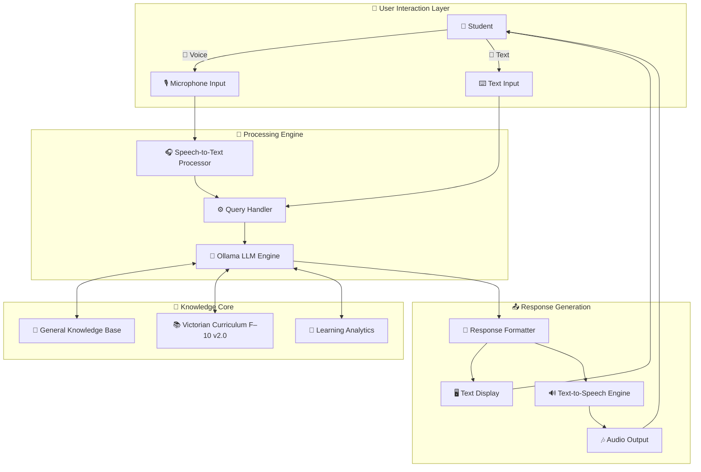

<div align="center">

# 🎓⚡ KinAI-Mentor - AI Educational Assistant
*Next-Gen Offline Learning & Intelligent Tutoring*

**[ 🤖 AI-POWERED ] • [ 🎤 VOICE-DRIVEN ] • [ 🔒 PRIVACY-FIRST ]**


<p align="center">
  
</p>

<p align="center">
  <strong>🧠 Local LLM • 🎯 Victorian Curriculum • 🔄 Speech Recognition • 🐍 Open Source</strong>
</p>

---

*Transform education with cutting-edge AI that listens, teaches, and empowers*

</div>


---

## 🚀 **The Vision**

<!-- Row 1: Identify the Challenge --> <table style="width: 100%; border-collapse: collapse; font-family: sans-serif;"> <tr> <td style="width: 500px; text-align: center; vertical-align: top; padding: 80px;">  </td> <td style="padding: 40px; vertical-align: top;"> <h2 style="color: #2563eb; display: flex; align-items: center; gap: 10px; margin-top: 0;"> <span style="font-size: 24px;">🔍</span> 1. Identify the Challenge </h2> <p> Modern education lacks personalized support due to time and resource limits. KinAI-Mentor solves this with an <strong>offline 🌐, open-source 🤖 AI tutor</strong>, aligned with the <strong>Victorian Curriculum F–10 Version 2.0 🎓</strong>, offering accessible, flexible learning for all students 🎯. </p> </td> </tr> </table> <!-- Row 2: Engineer the Approach --> <table style="width: 100%; border-collapse: collapse; font-family: sans-serif; background-color: #f9f9f9;"> <tr> <td style="padding: 40px; vertical-align: top;"> <h2 style="color: #16a34a; display: flex; align-items: center; gap: 10px; margin-top: 0;"> <span style="font-size: 24px;">⚙️</span> 2. Engineer the Approach </h2> <p> KinAI-Mentor uses a <strong>local LLM 🧠 via Ollama</strong> for real-time responses without internet 🌐. It combines <strong>speech-to-text 🎙️</strong> and <strong>text-to-speech 🔊 AI</strong> for hands-free interaction 💬. </p> <p> Fully offline, it ensures <strong>privacy 🔒</strong>, <strong>speed ⚡</strong>, and <strong>customizability</strong>, supporting both voice and text input/output 📱. </p> </td> <td style="width: 220px; text-align: center; vertical-align: top; padding: 40px;">  </td> </tr> </table> <!-- Row 3: Implement the Outcome --> <table style="width: 100%; border-collapse: collapse; font-family: sans-serif;"> <tr> <td style="width: 220px; text-align: center; vertical-align: top; padding: 40px;">  </td> <td style="padding: 40px; vertical-align: top;"> <h2 style="color: #dc2626; display: flex; align-items: center; gap: 10px; margin-top: 0;"> <span style="font-size: 24px;">✅</span> 3. Implement the Outcome </h2> <p> A fully functional, <strong>AI-driven tutoring system 🚀</strong> that runs locally on any device 📱. Students learn at their own pace using <strong>voice commands 🎙️</strong> or <strong>chat input 💬</strong>. </p> <p> Built with <strong>on-device AI</strong>, it supports diverse learners ♿—ideal for those with disabilities or limited digital access. An empowering, joyful step forward in education 🎉. </p> </td> </tr> </table>

**💬 Interactive** • **📱 Cross-Platform** • **♿ Accessible** • **🚀 Performance** • **🎉 Engaging**

</div>

---

## 🌟 Overview

> **Why KinAI-Mentor?** While tech giants focus on enterprise solutions, we're addressing a fundamental need: helping students learn effectively when traditional support isn't available.

**KinAI-Mentor** isn't just another educational app—it's a revolutionary **offline, voice-driven tutor** that brings personalized AI education to every student, regardless of their circumstances.

### 🎯 Key Differentiators

- **🆓 Completely Free** - No subscriptions, no hidden costs, no data collection
- **🔧 Fully Open Source** - Hackable, customizable, and community-driven
- **📚 Curriculum-Aligned** - Based on Victorian Curriculum F–10 Version 2.0 syllabus
- **🎤 Multi-Modal Interface** - Voice, text, and visual interaction modes
- **🌐 100% Offline** - Works without internet connectivity
- **♿ Accessibility-First** - Designed for students with diverse needs

---

## ⭐ Key Features

<div align="center">

| Feature | Description | Technology |
|:--------|:------------|:-----------|
| **🎤 Voice Input** | Speak questions naturally | Advanced speech recognition |
| **💬 Text Chat** | Traditional typing interface | Streamlit UI components |
| **🗣️ Voice Output** | Answers read aloud automatically | Local text-to-speech engine |
| **📃 Visual Display** | Clear text responses on screen | Responsive web interface |
| **🎓 Curriculum-Aligned** | Victorian Curriculum F–10 v2.0 compliant | Structured JSON database |
| **💻 Fully Offline** | No internet dependency | Local LLM processing |
| **🛠️ Open Source** | Free to modify and extend | MIT License |
| **🌍 Multilingual Ready** | Expandable language support | Modular architecture |

</div>

---

## 🏗️ System Architecture



### 📋 Component Overview

| Component | Function | Implementation |
|-----------|----------|----------------|
| **👤 User Interface** | Multi-modal input handling | Streamlit + Custom Components |
| **🎧 Speech Processing** | Voice-to-text conversion | Offline speech recognition library |
| **🧠 AI Engine** | Natural language processing | Ollama LLM (Llama 3) |
| **💾 Knowledge Base** | General educational content | Structured JSON database |
| **📚 Curriculum Engine** | Victorian F–10 v2.0 alignment | Curriculum-specific JSON |
| **🔊 Audio Output** | Text-to-speech synthesis | Local TTS engine |
| **🎯 Analytics** | Learning progress tracking | Local data storage |

---

## 🎯 Why Choose KinAI-Mentor?

### 🌟 Educational Benefits

| Benefit | Impact | Target Users |
|:--------|:-------|:-------------|
| **♿ Universal Accessibility** | Supports visual, auditory, and motor disabilities | Students with diverse needs |
| **🧠 Curriculum Alignment** | Structured learning based on Victorian F–10 v2.0 | Victorian students & educators |
| **🔄 Flexible Interaction** | Seamless voice ↔ text switching | All learning preferences |
| **📱 Hands-Free Learning** | Perfect for multitasking students | Busy families & accessibility users |
| **🔒 Privacy Protection** | Zero data collection or tracking | Privacy-conscious families |
| **🌍 Offline Capability** | Works in areas with poor connectivity | Rural & underserved communities |
| **🆓 Cost-Free Education** | No subscription or premium features | Low-income families |

### 🚀 Technical Advantages

- **⚡ High Performance** - Local processing for instant responses
- **🔧 Fully Customizable** - Open source architecture for modifications
- **📱 Cross-Platform** - Works on Windows, macOS, and Linux
- **🛡️ Secure by Design** - No external data transmission
- **📈 Scalable** - Easy to extend with new subjects or languages

---

## 🛠️ Quick Start Guide

### 📋 System Requirements

| Component | Minimum | Recommended | Purpose |
|:----------|:--------|:------------|:--------|
| **🐍 Python** | 3.8+ | 3.11+ | Core runtime environment |
| **🤖 Ollama** | Latest | Latest | Local LLM processing |
| **💾 RAM** | 8GB | 16GB+ | AI model performance |
| **💿 Storage** | 10GB | 20GB+ | Models and data |
| **🎤 Microphone** | Any USB/Built-in | High-quality | Voice input |
| **🔊 Speakers/Headphones** | Any | Good quality | Audio output |

### ⚡ Installation Steps

```bash
# 1️⃣ Clone the repository
git clone https://github.com/Logulokesh/kinai-mentor.git
cd kinai-mentor

# 2️⃣ Create and activate virtual environment
python3 -m venv kinai-env
source kinai-env/bin/activate  # Windows: kinai-env\Scripts\activate

# 3️⃣ Install Python dependencies
pip install -r requirements.txt

# 4️⃣ Install and setup Ollama
# Download from https://ollama.ai and install
ollama pull llama3

# 5️⃣ Verify installation
python -c "import streamlit; print('✅ Streamlit ready')"
ollama list  # Should show llama3 model

# 6️⃣ Launch KinAI-Mentor
streamlit run ui.py
```

### 🚀 Launch Commands

```bash
# Terminal 1: Start Ollama server
ollama serve

# Terminal 2: Run the AI model
ollama run llama3

# Terminal 3: Launch KinAI-Mentor interface
streamlit run ui.py
```

### 🔧 Configuration Options

```python
# config.py - Customize these settings
OLLAMA_MODEL = "llama3"  # Change AI model
VOICE_ENABLED = True     # Enable/disable voice features
TTS_SPEED = 1.0         # Adjust speech speed
CURRICULUM_VERSION = "VIC_F10_V2"  # Curriculum alignment
```

---

## 📁 Project Structure

```
kinai-mentor/
├── 📄 README.md              # Project documentation
├── 📋 requirements.txt       # Python dependencies
├── ⚙️ core_tutor.py         # Core AI logic & processing
├── 🖥️ ui.py                 # Streamlit user interface
├── 📚 syllabus.json         # Victorian Curriculum F–10 v2.0 data
├── 📂 voicetutor_db.json    # General knowledge base
├── 🔧 config.py             # Configuration settings
├── 🎨 assets/               # Images and media
├── 📊 data/                 # Curriculum and learning data
├── 🧪 tests/               # Unit tests
└── 📖 docs/                # Additional documentation
```

### 📄 File Descriptions

| File | Purpose | Importance |
|:-----|:--------|:-----------|
| `core_tutor.py` | AI logic and response generation | 🔴 Critical |
| `ui.py` | User interface and interaction | 🔴 Critical |
| `syllabus.json` | Victorian Curriculum F–10 v2.0 structure | 🟡 Important |
| `voicetutor_db.json` | General knowledge database | 🟡 Important |
| `requirements.txt` | Python package dependencies | 🔴 Critical |

---

## 🛠️ Technology Stack

### 🔧 Core Technologies

<div align="center">

[](https://python.org)
[](https://streamlit.io)
[](https://ollama.ai)

</div>

### 🤖 AI & Audio Processing

<div align="center">


</div>

### 📚 Curriculum Integration

- **Victorian Curriculum F–10 Version 2.0** - Complete syllabus alignment
- **Subject Areas** - Mathematics, English, Science, Humanities
- **Learning Progressions** - Foundation to Year 10 coverage
- **Assessment Standards** - Achievement level mapping

---

## 🎓 Educational Alignment

### 📚 Victorian Curriculum F–10 Version 2.0 Integration

KinAI-Mentor is specifically designed to support the **Victorian Curriculum F–10 Version 2.0**, ensuring students receive curriculum-compliant educational assistance.

#### 🎯 Covered Learning Areas

| Learning Area | Year Levels | Key Features |
|:--------------|:------------|:-------------|
| **📝 English** | F-10 | Reading, writing, speaking, listening |
| **🔢 Mathematics** | F-10 | Number, algebra, geometry, statistics |
| **🔬 Science** | F-10 | Biological, chemical, physical, earth sciences |
| **🌍 Humanities** | F-10 | History, geography, civics, economics |
| **🎨 The Arts** | F-10 | Visual arts, music, drama, dance |
| **💪 Health & PE** | F-10 | Personal health, physical activity |
| **💻 Technologies** | F-10 | Digital technologies, design thinking |
| **🗣️ Languages** | F-10 | Expandable language support |

#### 🎯 Learning Progression Support

- **Foundation Level** - Early childhood learning foundations
- **Years 1-2** - Basic literacy and numeracy development
- **Years 3-4** - Skill building and concept introduction
- **Years 5-6** - Knowledge consolidation and application
- **Years 7-8** - Advanced concept exploration
- **Years 9-10** - Senior preparation and specialization

---

## 📸 Screenshots & Demo

<div align="center">

### 🖥️ Main Interface
*Clean, intuitive design optimized for learning*


---

### 💬 Interactive Learning Session
*Real-time AI tutoring in action*


---

### 🎤 Voice Interaction Mode
*Hands-free learning experience*


</div>

---

## 🤝 Contributing to KinAI-Mentor

<div align="center">

**🌟 Help us democratize education through AI! 🌟**

[](CONTRIBUTING.md)
[](https://github.com/Logulokesh/kinai-mentor/issues)
[](https://github.com/Logulokesh/kinai-mentor/pulls)

</div>

### 🔧 How to Contribute

1. **🍴 Fork** the repository on GitHub
2. **🌿 Create** a feature branch: `git checkout -b feature/amazing-improvement`
3. **💻 Make** your changes with clear, commented code
4. **✅ Test** your changes thoroughly
5. **📝 Document** new features or changes
6. **✉️ Commit** with descriptive messages: `git commit -m 'Add voice speed control'`
7. **🚀 Push** to your branch: `git push origin feature/amazing-improvement`
8. **📬 Submit** a Pull Request with detailed description

### 🎯 Contribution Areas

- **🧠 AI Model Integration** - Add new LLM support
- **🎤 Voice Processing** - Improve speech recognition
- **📚 Curriculum Expansion** - Add more subjects/regions  
- **♿ Accessibility Features** - Enhance inclusive design
- **🌍 Internationalization** - Add language support
- **🎨 UI/UX Improvements** - Better user experience
- **📱 Mobile Optimization** - Responsive design
- **🧪 Testing & QA** - Improve reliability
- **📖 Documentation** - Better guides and tutorials

---

## 📜 License & Legal

<div align="center">

[](https://opensource.org/licenses/MIT)

**Free to use, modify, and distribute under the MIT License**

</div>

### 🔓 Open Source Freedom

- ✅ **Commercial Use** - Use in commercial projects
- ✅ **Modification** - Adapt to your needs
- ✅ **Distribution** - Share with others
- ✅ **Private Use** - Use internally
- ✅ **Patent Use** - No patent restrictions

### 📋 Attribution Requirements

- Include original license text
- Credit original authors
- Note any modifications made

---

## 🎉 Acknowledgments

### 🙏 Special Thanks

- **Victorian Curriculum Authority** - For curriculum standards
- **Ollama Team** - For local LLM technology
- **Streamlit Community** - For the amazing framework
- **Open Source Contributors** - For inspiration and code
- **Educators & Students** - For feedback and testing

---

<div align="center">

## 🌟 Join the Educational Revolution

**KinAI-Mentor** represents the future of personalized, accessible education. By combining cutting-edge AI with offline capabilities and curriculum alignment, we're creating learning opportunities for every student, regardless of their circumstances.

### 🚀 Get Started Today

```bash
git clone https://github.com/Logulokesh/kinai-mentor.git && cd kinai-mentor && pip install -r requirements.txt && streamlit run ui.py
```

---

<div align="center">

[](https://github.com/Logulokesh/KinAI-Ecosystem/graphs/contributors)

</div>

---

## 📄 License

Yes, it’s completely free — just like a gesture of support 🤝, a nod of appreciation 👍, or a reassuring smile 😊.

---

<div align="center">

**Built with passion ❤️ for privacy, intelligence, and automation**

</div>
