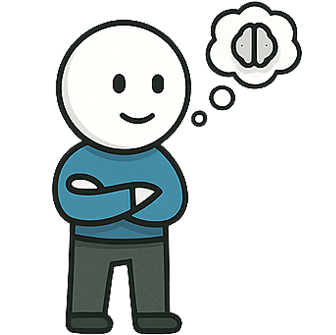
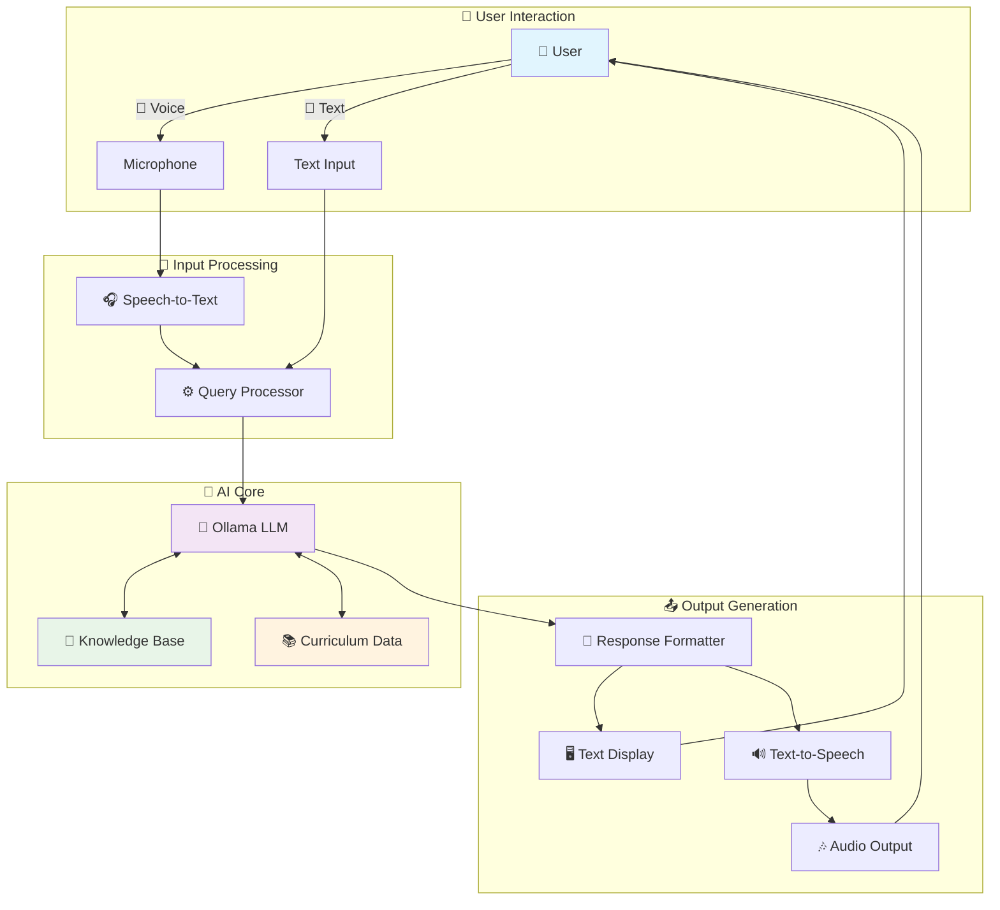

# 🎓 KinAI-Mentor

<div align="center">

### *Open-Source, Offline Educational Assistant Powered by Local LLM*

---

[](https://python.org)
[](https://streamlit.io)
[](https://ollama.ai)
[](LICENSE)
[](https://github.com)

**🌟 A 100% offline, open-source, voice-driven tutor that's free, flexible, and aligned with the Victorian Curriculum F–10 Version 2.0 🌟**
<p align="center">
  
</p>
</div>

---

## 🚀 **The Vision**

<!-- Row 1: Identify the Challenge --> <table style="width: 100%; border-collapse: collapse; font-family: sans-serif;"> <tr> <td style="width: 500px; text-align: center; vertical-align: top; padding: 80px;">  </td> <td style="padding: 40px; vertical-align: top;"> <h2 style="color: #2563eb; display: flex; align-items: center; gap: 10px; margin-top: 0;"> <span style="font-size: 24px;">🔍</span> 1. Identify the Challenge </h2> <p> Modern education lacks personalized support due to time and resource limits. KinAI-Mentor solves this with an <strong>offline 🌐, open-source 🤖 AI tutor</strong>, aligned with the <strong>Victorian Curriculum F–10 Version 2.0 🎓</strong>, offering accessible, flexible learning for all students 🎯. </p> </td> </tr> </table> <!-- Row 2: Engineer the Approach --> <table style="width: 100%; border-collapse: collapse; font-family: sans-serif; background-color: #f9f9f9;"> <tr> <td style="padding: 40px; vertical-align: top;"> <h2 style="color: #16a34a; display: flex; align-items: center; gap: 10px; margin-top: 0;"> <span style="font-size: 24px;">⚙️</span> 2. Engineer the Approach </h2> <p> KinAI-Mentor uses a <strong>local LLM 🧠 via Ollama</strong> for real-time responses without internet 🌐. It combines <strong>speech-to-text 🎙️</strong> and <strong>text-to-speech 🔊 AI</strong> for hands-free interaction 💬. </p> <p> Fully offline, it ensures <strong>privacy 🔒</strong>, <strong>speed ⚡</strong>, and <strong>customizability</strong>, supporting both voice and text input/output 📱. </p> </td> <td style="width: 220px; text-align: center; vertical-align: top; padding: 40px;">  </td> </tr> </table> <!-- Row 3: Implement the Outcome --> <table style="width: 100%; border-collapse: collapse; font-family: sans-serif;"> <tr> <td style="width: 220px; text-align: center; vertical-align: top; padding: 40px;">  </td> <td style="padding: 40px; vertical-align: top;"> <h2 style="color: #dc2626; display: flex; align-items: center; gap: 10px; margin-top: 0;"> <span style="font-size: 24px;">✅</span> 3. Implement the Outcome </h2> <p> A fully functional, <strong>AI-driven tutoring system 🚀</strong> that runs locally on any device 📱. Students learn at their own pace using <strong>voice commands 🎙️</strong> or <strong>chat input 💬</strong>. </p> <p> Built with <strong>on-device AI</strong>, it supports diverse learners ♿—ideal for those with disabilities or limited digital access. An empowering, joyful step forward in education 🎉. </p> </td> </tr> </table>

**💬 Interactive** • **📱 Cross-Platform** • **♿ Accessible** • **🚀 Performance** • **🎉 Engaging**

</div>

---

## 🌟 **Overview**

> **Why KinAI-Mentor?** While tech giants focus on enterprise AI tools, we're solving something fundamental: helping kids learn when life gets busy. 

**KinAI-Mentor** isn't just another educational app—it's a **100% offline, open-source, voice-driven tutor** that's:
- 🆓 **Completely Free** - No subscriptions, no hidden costs
- 🔧 **Fully Customizable** - Open-source and hackable
- 📚 **Curriculum-Aligned** - Victorian Curriculum F–10 Version 2.0
- 🎤 **Voice & Text Ready** - Multiple interaction modes

---

## ⭐ **Key Features**

<div align="center">

| 🎤 **Voice Input** | 💬 **Chat Input** | 🗣️ **Voice Output** | 📃 **Text Display** |
|:---:|:---:|:---:|:---:|
| Speak your questions naturally | Type queries traditionally | Answers read aloud via TTS | Visual responses on screen |

| 🎓 **Curriculum-Aligned** | 💻 **100% Offline** | 🛠️ **Open-Source** | 🔊 **Multilingual** |
|:---:|:---:|:---:|:---:|
| Victorian Curriculum F–10 V2.0 | No internet dependency | Free to modify & extend | Optional language models |

</div>

---

## 🏗️ **System Architecture**



### 📋 **How It Works**

<details>
<summary><b>🔍 Click to expand architecture details</b></summary>

| Component | Function | Technology |
|-----------|----------|------------|
| **👤 User Interface** | Voice/text input handling | Streamlit + Speech Recognition |
| **🎧 Speech Processing** | Voice-to-text conversion | Offline speech recognition |
| **🧠 AI Engine** | Query processing & responses | Ollama LLM (local) |
| **💾 Knowledge Base** | General learning content | JSON database |
| **📚 Curriculum** | Victorian Curriculum alignment | Structured JSON |
| **🔊 Audio Output** | Text-to-speech synthesis | Local TTS engine |

</details>

---

## 🎯 **Why Choose KinAI-Mentor?**

<div align="center">

| **🌟 Benefit** | **🔥 Why It Matters** |
|:---|:---|
| **♿ Accessible Design** | Supports auditory, visual, and diverse learners |
| **🧠 Curriculum-Focused** | Aligned with Victorian Curriculum F–10 V2.0 |
| **🔁 Multi-Modal** | Seamless voice ↔ text switching |
| **📱 Hands-Free Learning** | Perfect for multitasking or accessibility needs |
| **🌍 Privacy-First** | 100% offline - your data never leaves your device |
| **🔧 Developer-Friendly** | Open-source, customizable, and extensible |
| **⚡ No Dependencies** | Works without internet, subscriptions, or accounts |

</div>

---

## 🛠️ **Quick Start**

### 📋 **Prerequisites**

<div align="center">

| Requirement | Version | Purpose |
|:---:|:---:|:---:|
| 🐍 **Python** | 3.8+ | Core runtime |
| 🤖 **Ollama** | Latest | Local LLM |
| 🎤 **Microphone** | Any | Voice input |
| 🔊 **Audio Output** | Any | Voice responses |

</div>

### ⚡ **Installation**

```bash
# 1️⃣ Clone the repository
git clone https://github.com/Logulokesh/kinai-mentor.git
cd kinai-mentor

# 2️⃣ Create virtual environment
python3 -m venv venv
source venv/bin/activate  # Windows: venv\Scripts\activate

# 3️⃣ Install dependencies
pip install -r requirements.txt

# 4️⃣ Setup Ollama
# Download from https://ollama.ai
ollama pull llama3

# 5️⃣ Launch KinAI-Mentor
streamlit run ui.py
```

### 🚀 **Launch Commands**

```bash
# Start Ollama server
ollama run llama3

# Launch KinAI-Mentor interface
streamlit run ui.py
```

---

## 📁 **Project Structure**

<div align="center">

| File | Purpose | Icon |
|:---|:---|:---:|
| `core_tutor.py` | Core AI logic & processing | ⚙️ |
| `ui.py` | Streamlit user interface | 🖥️ |
| `syllabus.json` | Victorian Curriculum data | 📚 |
| `voicetutor_db.json` | Knowledge base | 📂 |
| `requirements.txt` | Python dependencies | 📋 |
| `README.md` | Documentation | 📖 |

</div>

---

## 🛠️ **Tech Stack**

<div align="center">

### **Core Technologies**

[](https://python.org)
[](https://streamlit.io)
[](https://ollama.ai)

### **AI & Audio**


</div>

---

## 🤝 **Contributing**

<div align="center">

**🌟 Help us make learning more accessible! 🌟**

[](CONTRIBUTING.md)
[](https://github.com/Logulokesh/kinai-mentor/issues)
[](https://github.com/Logulokesh/kinai-mentor/pulls)

</div>

### 🔧 **How to Contribute**

1. 🍴 **Fork** the repository
2. 🌿 **Create** a feature branch (`git checkout -b feature/amazing-feature`)
3. ✅ **Commit** your changes (`git commit -m 'Add amazing feature'`)
4. 🚀 **Push** to the branch (`git push origin feature/amazing-feature`)
5. 📬 **Open** a Pull Request

---

## 📜 **License**

<div align="center">

[](https://opensource.org/licenses/MIT)

**Free to use, modify, and distribute under the MIT License**

</div>

---

## 📸 **Screenshots**

<div align="center">

### 🖥️ **Main Interface**
*Clean, intuitive design for seamless learning*


---

### 💬 **Interactive Learning**
*Real-time conversations with AI tutor*


---

### 🎤 **Voice Interaction**
*Hands-free learning experience*


---

### 📚 **Curriculum Content**
*Victorian Curriculum F–10 Version 2.0 aligned*


---

### 🎯 **Learning Dashboard**
*Track progress and engagement*


</div>

---

**Made with ❤️ for accessible education**

---

*KinAI-Mentor - Empowering learners through intelligent, offline AI tutoring*

</div>
